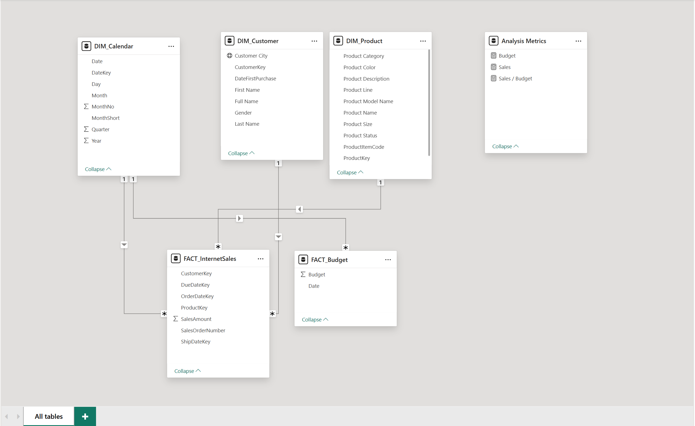
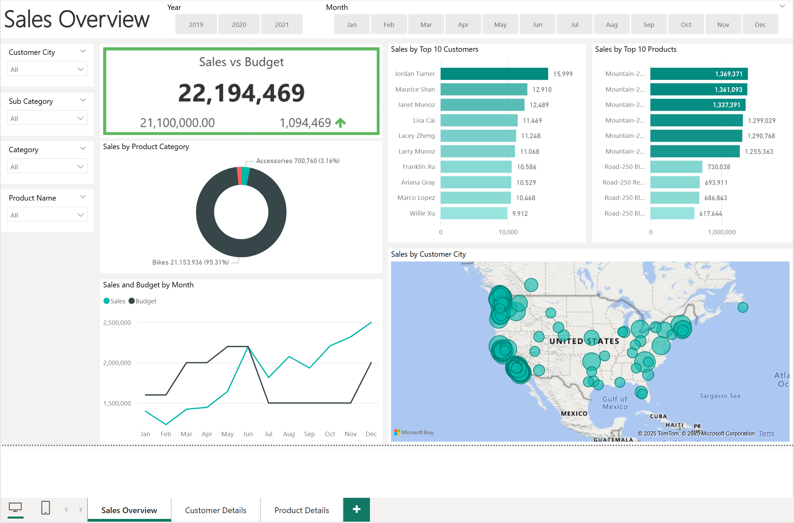
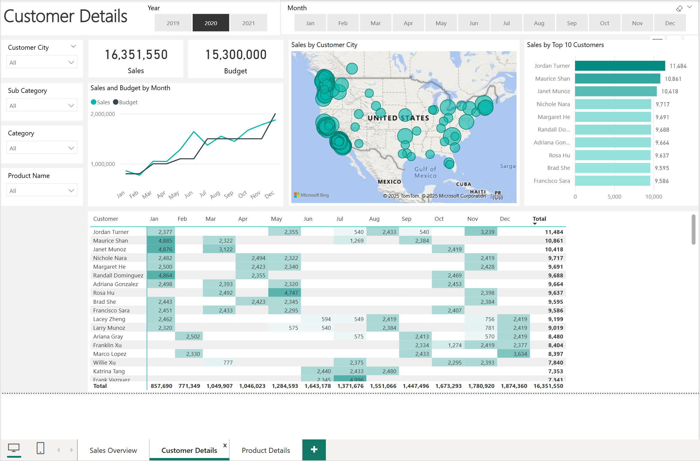
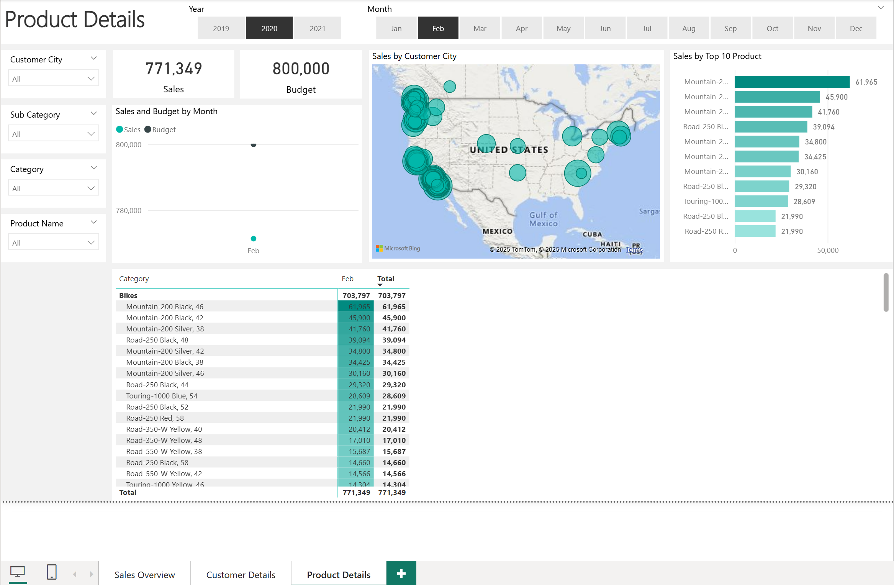

## Sales Analysis Project – Using SQL & Power BI

### PROJECT OVERVIEW
This project delivers a comprehensive Sales Analysis & Management Dashboard built using SQL for data cleansing/transformation and Power BI for data modeling and visualization. The dashboard provides actionable insights for Sales Managers and Sales Representatives by highlighting top-performing customers, best-selling products, and overall sales trends.

The solution aligns with user stories defined by business stakeholders and supports better decision‑making around sales performance, customer segmentation**, product strategy, and sales follow‑ups.

#### Value Delivered
- Comprehensive dashboards for sales teams
- Automated daily refresh
- Improved sales visibility and performance tracking
- Faster follow‑ups on customer and product performance

#### Tools Used
- SQL Server (MSSQL)– Data extraction, cleansing, and transformation
- Power BI – Data modeling, DAX measures, dashboards, and KPIs
---

### BUSINESS REQUEST AND OBJECTIVE
Value of Change: Visual dashboard, improved sales reporting, lean visibility for follow ups and shaping strategies

#### User Stories & Acceptance Criteria
| Role | Requirement | User Value | Acceptance Criteria |
|------|-------------|-------------|----------------------|
| Sales Manager | Get an overview of internet sales | Identify best customers & products | Power BI dashboard with daily refresh |
| Sales Manager | Compare sales vs. budget | Track performance over time | Dashboard with graphs, KPIs, and budget comparison |
| Sales Representative | View sales per customer | Segment & follow up with customers | Dashboard with customer‑level filters |
| Sales Representative | View sales per product | Track best‑selling products | Dashboard with product‑level filters |

---

### ANALYSIS PROCESS
### Refined Problem Statement
Develop a comprehensive sales dashboard to support sales reporting, highlighting top-performing customers, best-selling products, and key sales trends. The dashboard should incorporate dynamic filters to facilitate targeted decision-making across marketing, product strategy, and customer engagement.

Develop a dynamic sales dashboard to:
- Track revenue, customer performance, and product performance
- Allow detailed filtering by customer, product, region, and date
- Integrate sales budget for comparison analytics

### Data Preparation (SQL)
Four tables were extracted, cleaned, and transformed:
- `DIM_Calendar`
- `DIM_Customer`
- `DIM_Product`
- `FACT_InternetSales`

Key SQL tasks performed:
- Handle missing or inconsistent data
- Standardize tables
- Build relationships between dimension and fact tables
- Prepare data for modeling in Power BI

The **Sales Budget (Excel)** is imported directly and integrated into Power BI as a Fact table.

### Data Modeling
The final data model includes:
- Fact tables: `FACT_InternetSales`, `FACT_Sales_Budget`
- Dimension tables: Calendar, Customer, Product

Relationships were built to support:
- Date‑driven filtering
- Customer and product drill‑downs
- Comparative analysis between sales and budget

Dashboard Image:

### Power BI Dashboards
Delivered as a three-page Sales Management Dashboard:

### **1. Sales Overview**
- Total Sales
- Sales vs Budget KPIs
- Sales trend over time
- Top customers & top products
- Category and region breakdowns

Dashboard Image:

### **2. Customer Details**
- Sales by customer
- Segment-based views
- Top 10 customers
- Customer drill-down filters

Dashboard Image:

### **3. Product Details**
- Sales by product
- Top-selling items
- Category/sub-category performance
- Product trends & comparative insights

---

### Key Insights Enabled
- Which customers contribute the most revenue?
- Which products drive the highest sales volume?
- Are sales on track compared to the budget?
- What seasonal or monthly trends influence performance?
- Where should sales focus their follow‑ups?

### OUTCOME
The Sales Analysis solution:
- Streamlined reporting workflows
- Improved sales tracking accuracy
- Enabled proactive actions on customer & product performance
- Delivered a user‑friendly dashboard aligned with business needs

---

